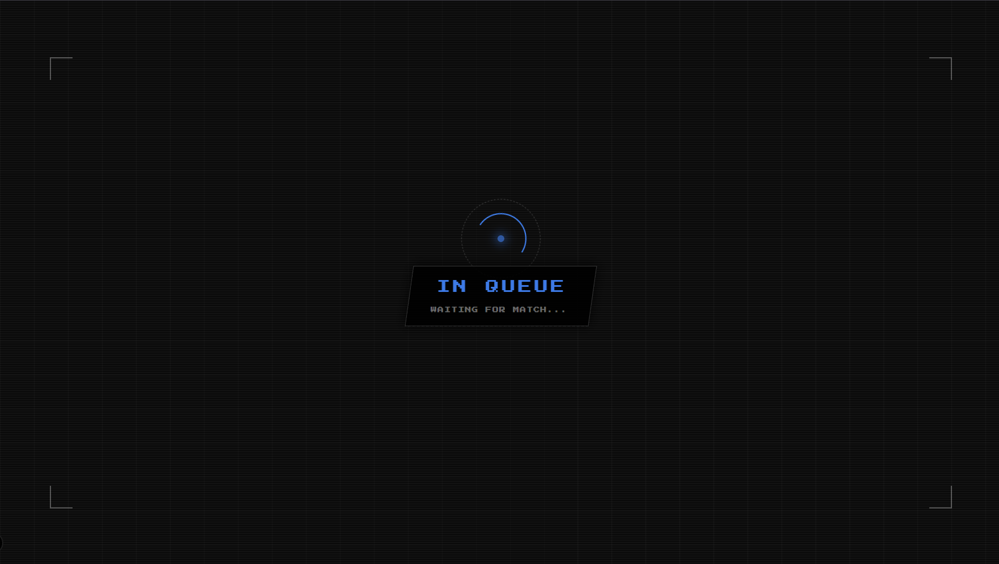
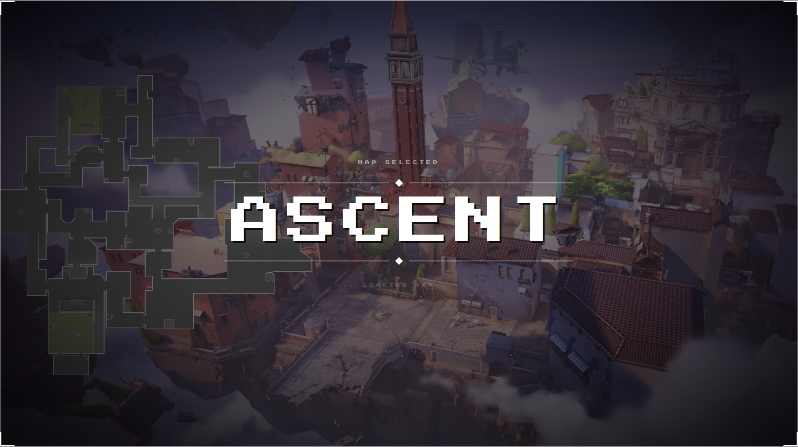
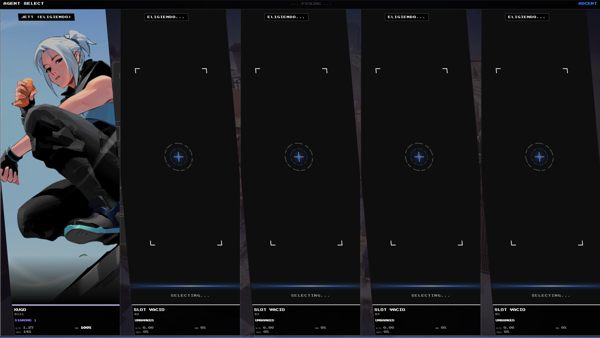
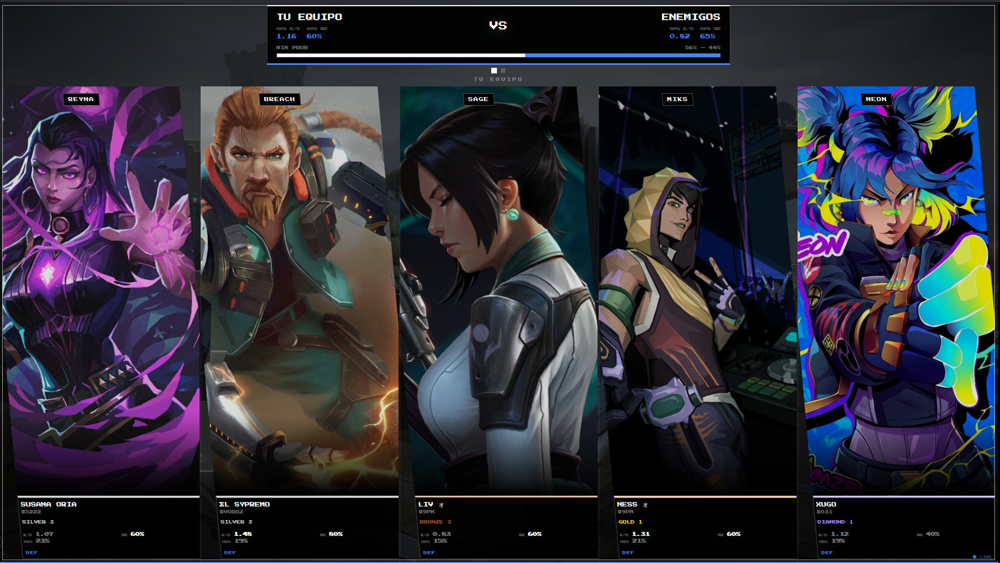

# VAL Stream Overlay - Dual Stats & Streaming Overlay

## 📖 About the Project
**VAL Stream Overlay** is a comprehensive statistics and visualization tool designed for Valorant players and content creators. The application operates through an innovative "dual overlay" system that separates the player's private tactical information from the visual experience shown to viewers on streaming platforms.

The application will be distributed as an official Overwolf desktop app, seamlessly hosting Overwolf Ads to ensure sustainability while complying with platform requirements.

## 🏗️ Architecture
The application is divided into two independent yet synchronized visual modules:

* **OBS Browser Overlay (Stream-Friendly):** A web source displaying polished graphics and engaging stats during loading screens and agent selection, capturing the audience's attention without interfering with gameplay.
* **In-Game Overlay (Desktop):** A native UI exclusively for the player. It displays real-time team stats (K/D, winrate, ranks) to help them make informed tactical decisions.

## ⚙️ Data Acquisition & Game Compliance
To ensure optimal performance and strict adherence to Riot's competitive integrity guidelines, our data logic relies on authorized sources:

1. **Overwolf GEP (Game Events Provider):** We use Overwolf's official infrastructure to securely read local game states (phase changes, current map, ally players). This ensures we do not make invasive client requests.
2. **Riot Games API:** We cross-reference permitted player IDs with the official Riot API (`VAL-MATCH-V1` endpoints) to fetch historical context (recent matches, K/D, win rate, rank) to populate our overlay graphics.

**⚠️ Commitment to Competitive Integrity:**
* **No Scouting:** The application will NEVER query or display data for enemy players before the game naturally reveals their identities in-game. We strictly respect the "Fog of War".
* **Ally Privacy:** We only query data for players currently in the user's lobby/team, adhering to Riot's anonymity guidelines if a player hides their identity.

---

## 🖼️ Visual Concepts & Mockups

> **Note on Compliance:** The screenshots below show the current UI/UX layout design from our early functional prototype. **All player stats, usernames, ranks, and match data displayed in these images are dummy/mock data used solely for visual presentation purposes.** The final production version will strictly query permitted allies in real-time and enforce Riot's "Fog of War" policies.

### OBS Browser Overlay (Stream-Friendly)
As previously mentioned, this app is tailored for content creators to create a more engaging visual experience for viewers during the agent selection and match loading screens.

*Figure 1: Not in game screen*

*Figure 2: Match found, shows map*

*Figure 3: Agent select screen*

*Figure 4: In game screen*

### In Game Overlay
*In development*

